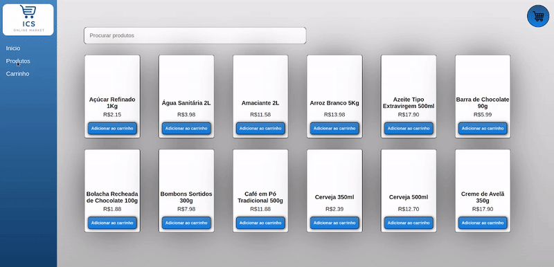
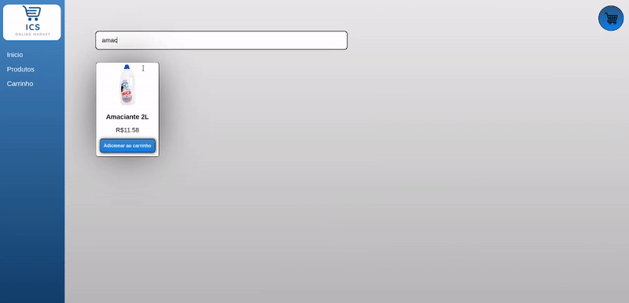
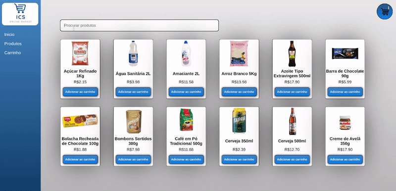

# Supermercado

## Sobre o projeto:

Este projeto foi solicitado pelo professor de linguagem de programação no curso de Sistemas de Informação no IFBA, inicialmente foi solicitado o desenvolvimento em Java, e após a sua conclusão resolvi reescrevê-lo em JavaScript. O projeto foi recriado com Html, Css e JavaScript. Este é um ótimo projeto base para ter em um site eccomerce para vendas de produtos.

## Funcionamento do projeto:

  

  

  

  

## Conceitos tratados:

- Objects;
- Arrays;
- Functions;
- DOM;
